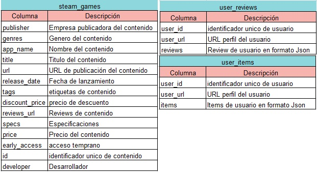



<h1 align='center'> Proyecto Individual N°1</h1>

<h2 align='center'> Machine Learning Operations (MLOps)</h2>

<h2 align='center'> JUAN CARLOS SANCHEZ COTES, DATAPT06</h2>

---

## **`TABLA DE CONTENIDOS`**

- [Introducción](#introducción)
- [Desarrollo](#desarrollo)
    - [ETL](#exploración-transformación-y-carga-etl)
    - [EDA](#análisis-exploratorio-eda)
    - [Modelo de recomendación](#modelo-de-recomendación)
    - [Despliegue de la API](#despliegue-para-la-api)
- [Contacto](#contacto)

- ## **`LINKS`**
    - [Carpeta de dataset](./datasets/)
    - [Procesos de ETL y EDA](./ETL%20y%20EDA/)
    - [Modelo de recomendación](./model/)
    - [API desplegada en Render](https://proyectoindividual-1-7sgi.onrender.com/docs#/)
    - [Link al video](pendiente)

---

# Introducción

En este proyecto, se llevará a cabo un estudio exhaustivo centrado en Machine Learning Operations (MLOps), una disciplina esencial para optimizar y gestionar el ciclo de vida de los modelos de Machine Learning. El enfoque se desglosará en diversas etapas metodológicas con el propósito de garantizar la efectividad y eficiencia del proceso.

1. **Exploración y Transformación:** La fase inicial abordará un análisis exploratorio de los datos, profundizando en la exploración de distribuciones, la detección de correlaciones y la identificación de valores atípicos. Este paso crítico proporcionará una base sólida para las etapas subsiguientes del estudio.

2. **Preparación de Datos:** Se llevará a cabo una cuidadosa preparación de los datos para desentrañar las complejas relaciones entre las variables. Además, se desarrollarán funciones específicas para consultas a los datos, las cuales serán accesibles a través de una interfaz de programación de aplicaciones (API), facilitando la interoperabilidad y el consumo eficiente de datos.

3. **Modelado:** La fase de modelado constituirá un componente central del proyecto, donde se diseñarán y desarrollarán modelos de Machine Learning. Estos modelos no solo buscarán comprender las complejas relaciones en los datos, sino también predecir correlaciones significativas entre variables, aportando así una perspectiva predictiva clave.

El conjunto de datos utilizado en este estudio abarca información detallada sobre juegos disponibles en la plataforma Steam, así como la interacción de los usuarios con dichos juegos. Este enfoque integral permitirá revelar patrones significativos y generar percepciones valiosas que contribuirán al avance del conocimiento en el ámbito del Machine Learning y las operaciones asociadas.

## Diccionario de Datos

---

# Desarrollo

### Exploración, Transformación y Carga (ETL)

A partir de los 3 datasets proporcionados por Henry (steam_games, user_reviews y user_items) referentes a la plataforma de Steam, en primera instancia se realizó el proceso de limpieza de los datos.

#### `steam_games`

- Se eliminaron filas completamente nulas y se corrigieron duplicados en el ID.
- Se completaron nulos en los géneros a partir de los datos de tags.
- Se completaron los valores de precio cuando este tenía un formato erróneo y era Free To Play; además, se normalizó la columna a valores reales.
- Las variables nulas en precio (menos del 4%) se eliminaron; otras filas con valores nulos también se eliminaron al no poder hacer un tratamiento más profundo y ser una pequeña parte del dataset.
- Se crearon variables ficticias (dummies) en la columna género para el análisis.
- Se extrajeron años de la columna release_date, teniendo en cuenta los distintos formatos, y las filas donde no podía extraerse el año se eliminaron.
- Se eliminaron columnas no utilizadas.
- Se exportó para tener el dataset limpio.

#### `user_reviews`

- Se realizó un explode ya que la columna de review era una lista de diccionarios.
- Se eliminaron filas con valores nulos en la columna de "reviews".
- Se creó una nueva columna llamada 'sentiment_analysis' usando análisis de sentimiento y se eliminó la columna de review.
- Se exportó para tener el dataset limpio.

#### `user_items`

- Se realizó un explode ya que la columna de items era una lista de diccionarios.
- Se eliminaron filas con valores nulos en la columna de "items".
- Se exportó para tener el dataset limpio.

### Análisis Exploratorio (EDA)

Teniendo los 3 dataset limpios, se realizó un proceso de EDA para realizar gráficos y así entender las estadísticas, encontrar valores atípicos y orientar un futuro análisis.

#### `steam_games`

- Primero se encontró la distribución de los precios a partir de un gráfico de cajas y bigotes, encontrando muchos valores atípicos. Sin embargo, considerando el contexto, no son valores necesariamente erróneos, ya que se pueden encontrar juegos de centavos de dólar y juegos de miles de dólares. Los últimos son los menos usuales.
- Se hizo un gráfico de barras con la distribución de juegos por año, incluyendo los contenidos Free. Se encontró que el año 2015 tuvo la mayor cantidad de juegos y la mayor cantidad de Free.

#### `user_reviews`

- Se realizó un gráfico de barras con la cantidad de sentimientos positivos y de estos, los que recomiendan. El resultado mostró que hubo muchos sentimientos positivos seguidos de los neutrales. Además, se observó que un porcentaje de los sentimientos positivos no recomiendan y en los sentimientos negativos, un porcentaje sí recomienda. Esto podría deberse a alguna falla en el análisis de sentimiento, sin embargo, es un porcentaje bajo.

#### `user_items`

- Para la columna playtime_forever, con un diagrama de cajas y bigotes, se analizó la distribución y se encontraron muchos valores atípicos. No obstante, a falta de un mejor análisis, no se realizará un tratamiento, ya que no necesariamente son errores; sin embargo, se debe verificar si hay algún valor de playtime_forever que para el ítem dado tenga más horas que el año de lanzamiento del ítem.
- En la verificación, se encontró que no hay ningún valor que cumpla estas condiciones, por lo que no se modificarán estos valores.
- También se calculó la dispersión entre playtime_forever y la cantidad de ítems.
- A partir de varias tablas, se graficaron los 15 juegos con más horas y los 15 desarrolladores con más horas en sus juegos.
- También se graficaron los desarrolladores con más recomendaciones positivas.

### Despliegue para la API

Se desarrollaron las siguientes funciones, a las cuales se podrá acceder desde la API en la página Render:

- **`developer(desarrollador: str)`**: Retorna la cantidad de ítems y el porcentaje de contenido gratis por año para un desarrollador dado.
- **`userdata(User_id: str)`**: Retorna el dinero gastado, cantidad de ítems y el porcentaje de comentarios positivos en la revisión para un usuario dado.
- **`UserForGenre(género: str)`**: Retorna al usuario que acumula más horas para un género dado y la cantidad de horas por año.
- **`best_developer_year(año: int)`**: Retorna los tres desarrolladores con más juegos recomendados por usuarios para un año dado.
- **`developer_rec(desarrolladora: str)`**: Retorna una lista con la cantidad de usuarios con análisis de sentimiento positivo y negativo para un desarrollador dado.
- **`ser_recommend(user:str)`**: Esta función recomienda 5 juegos para un usuario especificado usando un filtro colaborativo.

## Contacto

  
  

 

